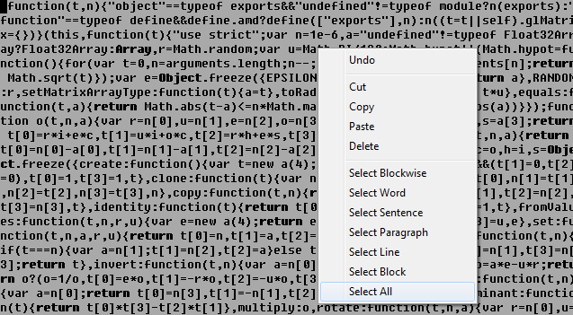

# Coloring Vim of scheme like an introvert; who doesn't like his stuff taking all attention to it

Do you get annoying when someone reading your stuff while your working on it behind of your computer?

We made a colors who makes anything feels right to be.... specially for those whos sneaking behind of us while we are seriously working in hours time.

With this colors you can actually outsmart your office partner to not looking at your works even Secret Service can using it as a tactic fighting terorist on his office.

Just copy it to your colors folder and updated, and thats it!

**Thats so many 'how to' install this colors in many os, figured yourself.**

`Available in black and white color.`

# Just don't tell your enemy 'How to used'

the only power it is a `:wq` or `:q` what'shoever...
